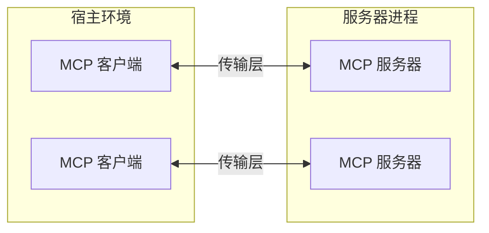
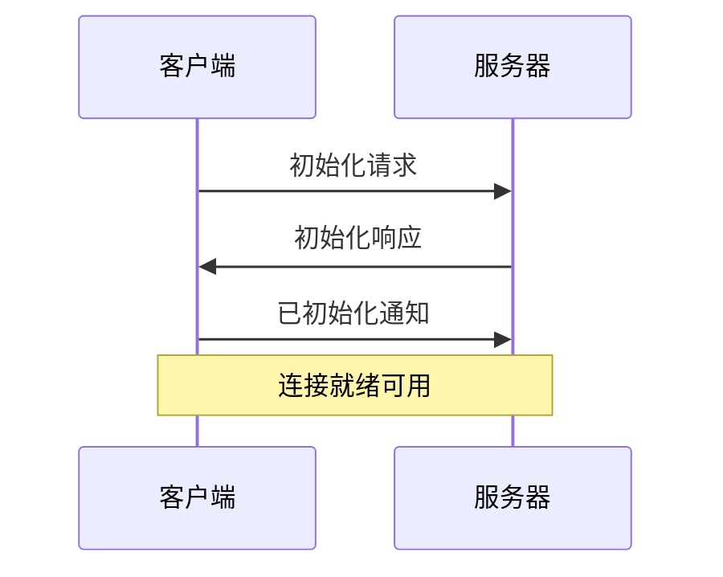

模型上下文协议（Model Context Protocol，简称 MCP）建立在灵活可扩展的架构之上，实现了大语言模型应用与集成之间的无缝通信。本文档详细介绍核心架构组件和基本概念。

## 概述

MCP 采用经典的客户端-服务器架构模式：

- **宿主环境**：指发起连接的大语言模型应用程序（如 Claude Desktop 或各类集成开发环境）
- **客户端**：位于宿主应用内部，负责维护与服务器的一对一连接
- **服务器**：负责向客户端提供上下文信息、工具能力和提示内容



## 核心组件

### 协议层

协议层主要负责消息封装、请求/响应配对以及高级通信模式的处理。

<Tabs>
  <Tab title="TypeScript">
    ```typescript
    class Protocol<Request, Notification, Result> {
        // 处理传入请求
        setRequestHandler<T>(schema: T, handler: (request: T, extra: RequestHandlerExtra) => Promise<r>): void

        // 处理传入通知
        setNotificationHandler<T>(schema: T, handler: (notification: T) => Promise<void>): void

        // 发送请求并等待响应
        request<T>(request: Request, schema: T, options?: RequestOptions): Promise<T>

        // 发送单向通知
        notification(notification: Notification): Promise<void>
    }
    ```
  </Tab>
  <Tab title="Python">
    ```python
    class Session(BaseSession[RequestT, NotificationT, ResultT]):
        async def send_request(
            self,
            request: RequestT,
            result_type: type[Result]
        ) -> Result:
            """
            发送请求并等待响应。如果响应包含错误，则抛出 McpError。
            """
            # 请求处理实现

        async def send_notification(
            self,
            notification: NotificationT
        ) -> None:
            """发送不需要响应的单向通知。"""
            # 通知处理实现

        async def _received_request(
            self,
            responder: RequestResponder[ReceiveRequestT, ResultT]
        ) -> None:
            """处理来自对方的传入请求。"""
            # 请求处理实现

        async def _received_notification(
            self,
            notification: ReceiveNotificationT
        ) -> None:
            """处理来自对方的传入通知。"""
            # 通知处理实现
    ```
  </Tab>
</Tabs>

主要核心类包括：

* `Protocol`（协议类）：负责基础通信协议实现
* `Client`（客户端类）：处理客户端特定逻辑
* `Server`（服务器类）：处理服务器特定逻辑

### 传输层

传输层负责处理客户端和服务器之间的实际数据传输。MCP 目前支持以下传输机制：

1. **标准输入输出传输**
   - 通过标准输入/输出流进行通信
   - 特别适用于本地进程间通信

2. **HTTP 与 SSE 传输**
   - 利用服务器发送事件（Server-Sent Events，SSE）实现服务器到客户端的消息推送
   - 通过 HTTP POST 请求实现客户端到服务器的消息发送

所有传输方式都采用 [JSON-RPC](https://www.jsonrpc.org/) 2.0 标准格式交换消息。关于模型上下文协议消息格式的更多详细信息，请参阅[官方规范文档](https://spec.modelcontextprotocol.io)。

### 消息类型

MCP 定义了以下几种主要消息类型：

1. **请求（Request）**：需要对方回应的消息：
    ```typescript
    interface Request {
      method: string;
      params?: { ... };
    }
    ```

2. **结果（Result）**：对请求的成功响应：
    ```typescript
    interface Result {
      [key: string]: unknown;
    }
    ```

3. **错误（Error）**：表示请求处理失败：
    ```typescript
    interface Error {
      code: number;
      message: string;
      data?: unknown;
    }
    ```

4. **通知（Notification）**：单向消息，不需要对方响应：
    ```typescript
    interface Notification {
      method: string;
      params?: { ... };
    }
    ```

## 连接生命周期

### 1. 初始化阶段



1. 客户端首先发送包含协议版本和能力声明的 `initialize` 请求
2. 服务器回应自身支持的协议版本和能力
3. 客户端发送 `initialized` 通知作为确认信号
4. 此后开始正常的消息交换过程

### 2. 消息交换阶段

初始化完成后，支持以下通信模式：

- **请求-响应模式**：客户端或服务器发送请求，另一方进行响应
- **通知模式**：任何一方可以发送不需要回应的单向通知消息

### 3. 终止阶段

连接可通过以下方式终止：
- 通过调用 `close()` 方法进行优雅关闭
- 传输层连接断开
- 发生严重错误条件

## 错误处理

MCP 定义了以下标准错误代码：

```typescript
enum ErrorCode {
  // 标准 JSON-RPC 错误代码
  ParseError = -32700,       // 解析错误：无法解析收到的JSON内容
  InvalidRequest = -32600,   // 无效请求：请求对象不符合规范
  MethodNotFound = -32601,   // 方法未找到：请求的方法不存在
  InvalidParams = -32602,    // 无效参数：提供的参数不正确
  InternalError = -32603     // 内部错误：处理请求时发生内部错误
}
```

开发者可以在自己的SDK和应用程序中定义自定义错误代码，但值必须大于 -32000。

错误信息通过以下途径传播：
- 作为请求的错误响应返回
- 通过传输层的错误事件机制
- 通过协议层的错误处理回调函数

## 实现示例

以下是一个基本的MCP服务器实现示例：

<Tabs>
  <Tab title="TypeScript">
    ```typescript
    import { Server } from "@modelcontextprotocol/sdk/server/index.js";
    import { StdioServerTransport } from "@modelcontextprotocol/sdk/server/stdio.js";

    const server = new Server({
      name: "example-server",
      version: "1.0.0"
    }, {
      capabilities: {
        resources: {}
      }
    });

    // 处理资源列表请求
    server.setRequestHandler(ListResourcesRequestSchema, async () => {
      return {
        resources: [
          {
            uri: "example://resource",
            name: "示例资源"
          }
        ]
      };
    });

    // 连接传输层
    const transport = new StdioServerTransport();
    await server.connect(transport);
    ```
  </Tab>
  <Tab title="Python">
    ```python
    import asyncio
    import mcp.types as types
    from mcp.server import Server
    from mcp.server.stdio import stdio_server

    app = Server("example-server")

    @app.list_resources()
    async def list_resources() -> list[types.Resource]:
        return [
            types.Resource(
                uri="example://resource",
                name: "示例资源"
            )
        ]

    async def main():
        async with stdio_server() as streams:
            await app.run(
                streams[0],
                streams[1],
                app.create_initialization_options()
            )

    if __name__ == "__main__":
        asyncio.run(main())
    ```
  </Tab>
</Tabs>

## 最佳实践

### 传输方式选择

1. **本地通信场景**
   - 优先选择标准输入输出传输方式
   - 在同一机器上通信效率更高
   - 进程管理更为简便

2. **远程通信场景**
   - 需要HTTP兼容性时，选择SSE传输方式
   - 注意考虑认证和授权等安全因素

### 消息处理建议

1. **请求处理原则**
   - 全面验证所有输入数据
   - 使用类型安全的数据模式
   - 实现友好的错误处理机制
   - 合理设置请求超时时间

2. **进度报告机制**
   - 长时间操作应使用进度标记
   - 定期发送进度更新信息
   - 尽可能提供总体进度指示

3. **错误管理策略**
   - 选择合适的错误代码
   - 提供有意义的错误信息
   - 错误发生时妥善清理资源

## 安全注意事项

1. **传输层安全**
   - 远程连接务必使用TLS加密
   - 严格验证连接来源
   - 根据需要实现适当的认证机制

2. **消息验证措施**
   - 严格验证所有传入消息
   - 对输入数据进行清理和过滤
   - 实施消息大小限制控制
   - 确保符合JSON-RPC格式规范

3. **资源保护机制**
   - 实现细粒度访问控制
   - 验证所有资源路径
   - 监控系统资源使用情况
   - 对请求实施速率限制

4. **安全错误处理**
   - 避免在错误信息中泄露敏感信息
   - 记录所有安全相关错误
   - 确保资源正确清理和释放
   - 具备应对拒绝服务攻击的能力

## 调试与监控指南

1. **日志记录建议**
   - 系统地记录所有协议事件
   - 跟踪消息流向和处理过程
   - 监控系统性能指标
   - 详细记录错误信息

2. **诊断功能实现**
   - 提供健康检查接口
   - 实时监控连接状态
   - 跟踪资源使用情况
   - 支持性能分析能力

3. **测试策略**
   - 全面测试不同传输方式
   - 验证各种错误处理场景
   - 重点检查边界条件处理
   - 进行服务器负载测试
